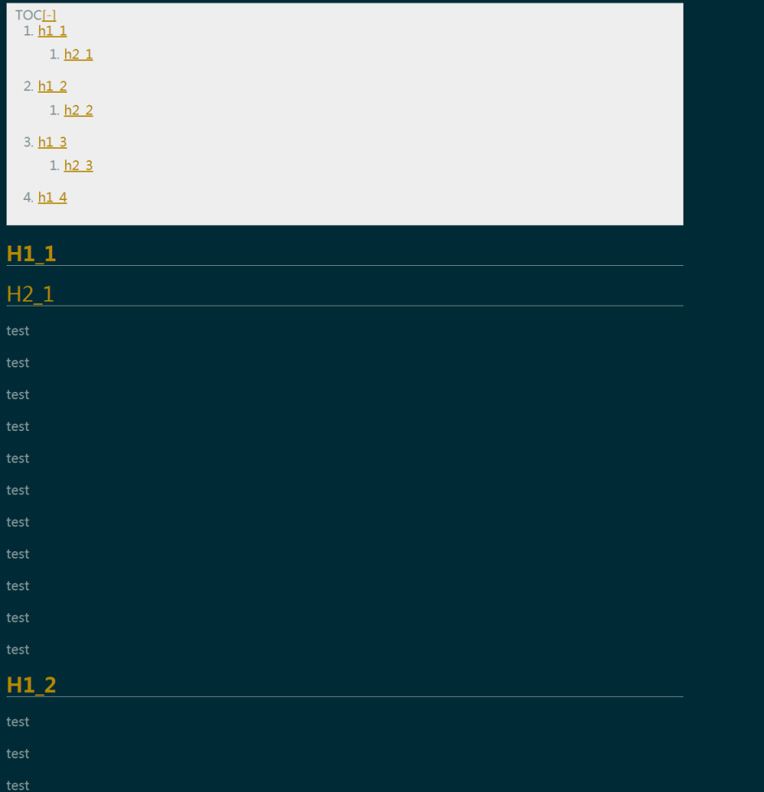

# about author
I copied the code from <http://www.cnblogs.com/JEckDe/p/5335272.html> by JEck_De and modified a little by myself.
- change the anchor's id to the headline's text rather than the variable sequence number 
- more international , haha!

# usage

add toc/table of content to html file exported by MarkdownPad2 

steps:
- just copy the content of the file addTOC.js into MarkdownPad2:Tools->Options->Advanced->HTML Head Editor 
- save and close the HTML Head Editor 
- create your own test.md just like test.md
- Ctrl + Shift + 1 or File->Export->Export HTML and will get  [./test.html](./test.html)
- you can save the test.html locally and have a try

# effect picture

 

# 2018-01-15-update

**move the addTOC.js to https://github.com/wzcprince/efficiency/blob/master/MarkdownPad2-configs/export_html_add_toc.js **
